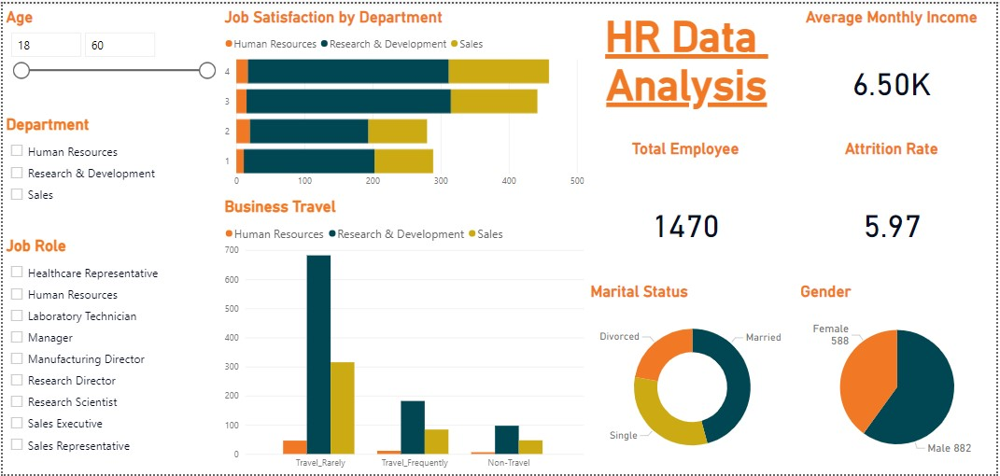

# HR Data Analysis Dashboard



[](https://www.python.org/)
[](https://pandas.pydata.org/)
[](https://powerbi.microsoft.com/)
[](LICENSE)

## 📌 Project Overview
This **HR Data Analysis Dashboard** provides valuable insights into employee attrition, job satisfaction, and workforce demographics. The dashboard is designed for HR professionals to analyze key metrics and improve workforce strategies.

## ✨ Features
- 📊 **Employee Attrition Analysis**
- 📌 **Job Satisfaction by Department**
- 🚀 **Business Travel Trends**
- 💰 **Average Monthly Income Breakdown**
- 📈 **Demographics Analysis (Gender, Marital Status, etc.)**
- 🔍 **Filter Options for Better Insights**

## 📂 Dataset Information
- **File:** `HR-Employee-Attrition.csv`
- **Columns:** Employee ID, Age, Department, Job Role, Monthly Income, Business Travel, Attrition, Marital Status, Gender, etc.
- **Size:** 1470 employee records

## 🛠️ Tech Stack
- **Power BI** - For interactive dashboard creation
- **Python (Pandas, Matplotlib)** - For data processing and visualization
- **CSV File** - Contains HR data for analysis

## 🚀 How to Use
1. **Clone the Repository**
   ```sh
   git clone https://github.com/momina02/HR-Data-Analysis.git
   cd HR-Data-Analysis
   ```
2. **Open `HR-Employee-Attrition.csv` in Power BI or Python**
3. **Run Data Analysis & Visualization**
4. **Explore the Interactive Dashboard**

## 🤝 Contributing
Contributions are welcome! Feel free to open issues or submit pull requests.

---
### ⭐ If you found this project useful, give it a **star** on GitHub! ⭐

